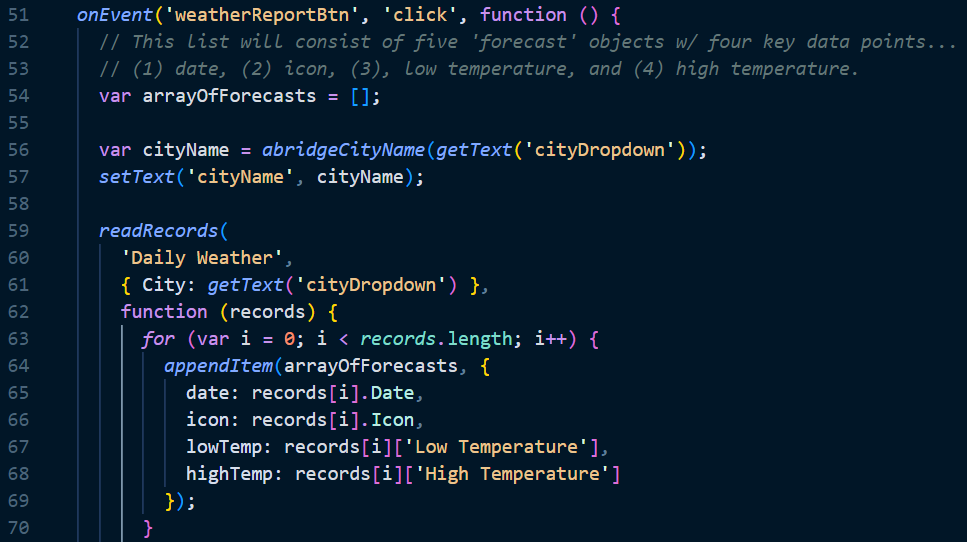
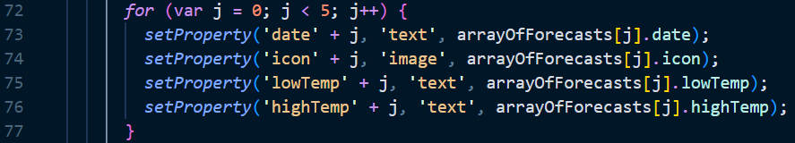
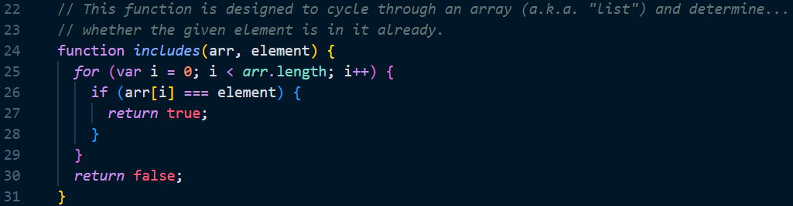
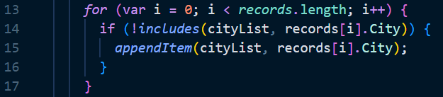

# AP CSP Create Task Exemplar: A Weather Forecasting App

Programming is a collaborative and creative process that brings ideas to life through the development of software. In the Create performance task, you will design and implement a program that might solve a problem, enable innovation, explore personal interests, or express creativity. Your submission must include elements listed in the following "Submission Requirements" sections.

### Program Code Submission Requirements

In your program you must include student-developed program code that contains the following:

- Instructions for **input** from one of the following:
  - the user (including user actions that trigger events)
  - a device
  - an online data stream
  - a file
- Use of at least one **list** (or other collection type) to represent a collection of data that is stored and used to manage program complexity and help fulfill the program's purpose.
  - Note, _the data abstraction must make the program easier to develop_ (alternatives would be more complex) or easier to maintain (future changes to the size of the list would otherwise require significant modifications to the program code).
- At least one **procedure (a.k.a. "function")** that contributes to the program's intended purpose, where you have defined:
  - the procedure's name
  - the return type (if necessary)
  - one or more parameters
- An **algorithm** that includes sequencing, selection, and iteration that is in the body of the selected procedure
- Calls to your student-developed procedure
- Instructions for **output** (tactile, audible, visual, or textual) **based on input** and program functionality

### Video Submission Requirements

Submit one video file that demonstrates your program running. It must include:

- **input** to your program
- at least one aspect of the functionality of your program
- **output** produced by your program

It may **NOT** contain:

- any distinguishing information about yourself
- voice narration (though text captions are encouraged)

It must be:

- either .mp4, .wmv, .avi, or .mov format
- no more than 1min in length
- no more than 30mb file size

### Exemplar Written Responses

Submit your responses to prompts 3(a) – 3(d), which are described below. Your responses to all prompts combined must not exceed 750 words (program code is not included in the word count).

**3(a).** In ~150 total words provide a written response that does all three of the following:

1. Describes the overall **purpose** of the program

_The overall purpose of my program is to provide users with accurate and up-to-date weather forecasts for their selected locations. Weather forecasts are essential for planning outdoor activities, scheduling travel, and preparing for severe weather events. By providing reliable weather information in an accessible and user-friendly format, my app aims to help users make informed decisions and stay safe and prepared in any weather condition. With this program, users will be able to stay ahead of the weather and plan their day-to-day activities with greater confidence and ease._

2. Describes what **functionality** of the program is demonstrated in the video

_In the video, the program's functionality is demonstrated by capturing user input for the state and city and presenting a five-day weather forecast for the selected location._

3. Describes the **input** and **output** of the program demonstrated in the video

_The user inputs a state and city, and the program provides a five-day weather forecast for the selected location. The forecast includes the date, weather icon, low temperature, and high temperature for each day._

**3(b).** Capture and paste two program code segments you developed during the administration of this task that contain a list (or other collection type) being used to manage complexity in your program.

1. The first program code segment must show how data have been stored in the list.

2. The second program code segment must show the data in the same list being used, such as creating new data from the existing data or accessing multiple elements in the list, as part of fulfilling the program’s purpose

Then provide a ~200 word written response that does all three of the following:

3. Identifies the **name of the list** being used in this response

_arrayOfForecasts_

4. Describes what the data contained in the list represents in your program

_The data in this list includes the date, icon, low temperature, and high temperature for each day of the forecast. This data is extracted from records in the "Daily Weather" table that match the selected city._

5. Explains how the selected list manages complexity in your program code by explaining why your program code could not be written or how it would be written differently if you did not use the list

_The selected list manages the complexity of the program code by storing the forecast data for each day in an organized and structured manner. This allows for easy access to the data when setting the text and image properties for each of the five forecast objects on the fiveDayForecastScreen._

_Without the use of the ‘arrayOfForecasts’ list, the program code would have to repeat the same process for each of the five forecast objects, iterating over the records and extracting the relevant data for each one. This would significantly increase the complexity and length of the code, making it more prone to errors and more difficult to maintain over time._

**3(c).** Capture and paste two program code segments you developed during the administration of this task that contain a student-developed procedure (a.k.a. “function”) that implements an algorithm used in your program and a call to that procedure.

1. The first program code segment must be a student-developed procedure that:

- Defines the **procedure's name** and return type (if necessary)
- contains and uses one or more **parameters** that have an effect on the functionality of the procedure
- implements an **algorithm** that includes sequencing, selection, and iteration

2. The second program code segment must show where your student-developed procedure is being called in your program

Then, provide a ~200 word written response that does both of the following:

3. Describes in general what the identified procedure does and how it contributes to the overall functionality of the program

_The includes procedure determines whether an element is already in an array. It checks whether a city is already in the city list. This function helps to prevent users from requesting information about a city that does not exist in the database. It is called in the callback function aligned to the confirmStateBtn click-event, which generates a list of cities to populate a dropdown menu based on the selected state._

4. Explains in detailed steps how the algorithm implemented in the identified procedure works. Your explanation must be detailed enough for someone else to recreate it.

_The algorithm implemented in the includes function is straightforward. The function takes two parameters, an array and an element, and checks whether the element is already in the array. It does this by iterating through the array and comparing each element to the given element. If the element is in the array, the function returns true. If it is not, the function returns false._

_The algorithm works by first initializing a for loop that cycles through each element of the array. At each iteration, the function compares the current element to the given element. If the current element is equal to the given element, the function immediately returns true to indicate that the element is in the array. If the function reaches the end of the loop without finding the element, it returns false to indicate that the element is not in the array._

**3(d).** Provide a ~200 word written response that does all three of the following:

1. Describes two calls to the procedure identified in written response 3(c). Each call must pass a different argument(s) that causes a different segment of code in the algorithm to execute.

- first call:

**includes([“Austin”, “Houston”, “Dallas”], “San Antonio”);**

- second call:

**includes([“San Francisco”, “Los Angeles”, “San Diego”], “San Francisco”);**

2. Describe what condition(s) is being tested by each call to the procedure.

- condition(s) tested by the first call:

_The first call tests the **includes** function by passing a list of cities in Texas as the first parameter and a single city, San Antonio, as the second. San Antonio is not included in the list passed as the first parameter._

- condition(s) tested by the second call:

_The second call tests the **includes** function by passing a list of cities in California as the first parameter and a single city, San Francisco, as the second. San Francisco is in the list passed as the first parameter._

3. Identifies the result of each call.

- result of the first call:

_false_

- result of the second call:

_true_
